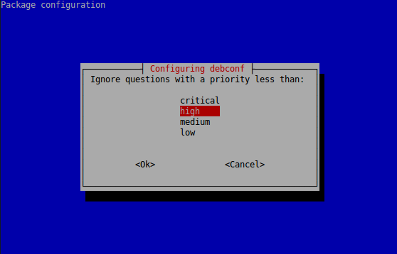

# Repositoris de paquets

El programari es distribueix mitjançant paquets, i aquests s'organitzen en dipòsits que anomenem fonts de programari o repositoris. Cada distribució compta amb els seus repositoris propis, on emmagatzemen tot el programari que és suportat per la distribució. A banda, espoden incloure altres fonts d'altres distribucions compatibles o de tercers, per disposar d'un ventall més ampli de programari on escollir.

## Paquets a ubuntu: packages.ubuntu.com

Ubuntu posa al nostre abast una eina web per consultar els seus repositoris, de manera que qualsevol paquet que desitgem descarregar, tant font com binari, pot obtenir-se des de http://packages.ubuntu.com/nom_binari o bé http://packages.ubuntu.com sense especificar el nom del binari, per accedir a una pàgina de cerca de paquets.


Per altra banda, en http://launchpad.net/ubuntu/+archivemirrors podem trobar una llista completa dels repositoris d'Ubuntu, amb més informació, sobre bugs, estat de les traduccions, paquet, codi font no inclòs oficialment, faqs...

La distribució de base d'Ubuntu, Debian, disposa també d'aquest mecanisme, a través de http://packages.debian.org, per a la descàrrega i consulta de paquets, així com podem trobar els seus repositoris oficials en http://debian.org/mirror/official.es.html. 

De vegades, no tenim disponible un paquet o una versió concreta als repositoris propis d'Ubuntu, pel que es pot provar el paquet o la versió allotjada als repositoris de Debian.

## Launchpad

La plataforma web de desenvolupament col·laboratiu Launchpad, desenvolupada i mantinguda per Canonical Ltd. permet  construir, mantenir i publicar paquets, entre d'altres funcionalitats com allotjar el codi font, realitzar seguiment de bugs, suport de traduccions o faqs.

La manera que ofereix Launchpad de pujar paquets font per ser construïts i publicats com a repositoris preparats per a APT és mitjançant els Personal Package Archives (PPA), que com el seu nom indica, són repositoris de paquets personals o bé d'un grup.

En el mateix Launchpad podem obtenir una llista completa dels repositoris oficials d'Ubuntu en: https://launchpad.net/ubuntu/+archivemirrors.

Els paquets oficials de LliureX es troben agrupats en diversos repositoris de Launchpad, a partir del lloc del grup https://launchpad.net/~llxdev. Per exemple, el lloc base per als paquets de LliureX 14.06 (Platinum) es troba a: https://launchpad.net/~llxdev/+archive/ubuntu/platinum, i el pool en: http://ppa.launchpad.net/llxdev/platinum/ubuntu/

Per tal d'afegir estos pools a la llista de fonts disponibles al sistema (fitxer sources.list), només caldrà indicar al fitxer les línies que ens indica Launchpad per al pool:


Com veiem a la imatge, Launchpad ens deixa triar la versió d'Ubuntu per a la que estan construirs els paquets. Així, si per exemple Platinum (LliureX 14.06) es basa en Precise (Ubuntu 12.04), haurem de triar Precise com a versió d'Ubuntu, pel que les línies que haurem d'afegir al sources.list serien:

```
deb http://ppa.launchpad.net/llxdev/platinum/ubuntu precise main 
deb-src http://ppa.launchpad.net/llxdev/platinum/ubuntu precise main 
```

Per al cas de LliureX 15.05, la Ubuntu base és Trusty, pel que caldria afegir al sources.list:

```
deb http://ppa.launchpad.net/llxdev/trusty/ubuntu trusty main 
deb-src http://ppa.launchpad.net/llxdev/trusty/ubuntu trusty main 
```

Una vegada afegitdes les línies al sources.list, caldrà importar les claus. Per a això farem ús de l'ordre apt-key i el valor que ens mostra Launchpad com a Fingerprint:

```
$ sudo apt-key adv --keyserver keyserver.ubuntu.com --recv-keys 19966B196723CE3CF90E0F34476079AF7B19579E 
Executing: gpg --ignore-time-conflict --no-options --no-default-keyring --secret-keyring /tmp/tmp.6tu8L17w46 --trustdb-name /etc/apt/trustdb.gpg --keyring /etc/apt/trusted.gpg --primary-keyring /etc/apt/trusted.gpg --keyserver keyserver.ubuntu.com --recv-keys 19966B196723CE3CF90E0F34476079AF7B19579E 
gpg: solicitando clave 7B19579E de hkp servidor keyserver.ubuntu.com 
gpg: clave 7B19579E: clave pública "Launchpad PPA for llxdev" importada 
gpg: Nombre total processat: 1 
gpg:               importades: 1  (RSA: 1) 
```

Una manera més senzilla d'afegir automàticament els repositoris i les claus és fent ús de l'ordre apt-add-repository:

```
$ sudo apt-add-repository "deb http://ppa.launchpad.net/llxdev/platinum/ubuntu precise main "
gpg: s'ha creat l'anell «/tmp/tmpvOcAim/secring.gpg»
gpg: s'ha creat l'anell «/tmp/tmpvOcAim/pubring.gpg»
gpg: solicitando clave 7B19579E de hkp servidor keyserver.ubuntu.com
gpg: /tmp/tmpvOcAim/trustdb.gpg: s'ha creat la base de dades de confiança
gpg: clave 7B19579E: clave pública "Launchpad PPA for llxdev" importada
gpg: Nombre total processat: 1
gpg: importades: 1  (RSA: 1)
OK
```

i de la mateixa manera amb deb-src.

Per al cas d'apt-add-reposiroty, quan es tracte d'un ppa, podem fer ús directament del nom del ppa:

```
$ sudo add-apt-repository ppa:llxdev/platinum
You are about to add the following PPA to your system:
 This is a PPA for Platinum version of LliureX (14.06).

Download the Beta releases at:
http://releases.lliurex.net/index.php?lang=qcv&ver=14.06&nolang=0

 More info: https://launchpad.net/~llxdev/+archive/ubuntu/platinum
Press [ENTER] to continue or ctrl-c to cancel adding it

gpg: s'ha creat l'anell «/tmp/tmpdOU3za/secring.gpg»
gpg: s'ha creat l'anell «/tmp/tmpdOU3za/pubring.gpg»
gpg: solicitando clave 7B19579E de hkp servidor keyserver.ubuntu.com
gpg: /tmp/tmpdOU3za/trustdb.gpg: s'ha creat la base de dades de confiança
gpg: clave 7B19579E: clave pública "Launchpad PPA for llxdev" importada
gpg: Nombre total processat: 1
gpg:               importades: 1  (RSA: 1)
OK
```

## Establint preferències en apt: apt-pinning

El mecanisme de pining permet establir prioritats sobre les versions dels paquets i els repositoris que s'instal·len amb apt. Amb el pinning forcem o retenim determinades actualitzacions o prioritzem certs repositoris o components.

Les prioritats influencien en el comportament d'APT, de manera que, per a cada paquet, sempre se seleccionarà la versió amb la prioritat més alta, llevat de si aquesta versió és anterior a la instal·lada i si la seua prioritat és inferior a 1000.

Apt defineix diverses prioritats determinades:

* Cada versió instal·lada té una prioritat de 100.
* Una versió no instal·lada té una priotitat de 500, però pot ser 990 si és part de la distribució de destí (definida amb apt-get -t distirbució o amb la directiva de configuració APT::Default-Release.

Si fem un `apt-cache policy`, podem veure les prioritats de cadascun dels paquets:

```
$ apt-cache policy
Package files:
 100 /var/lib/dpkg/status
     release a=now
 500 http://ppa.launchpad.net/nilarimogard/webupd8/ubuntu/ trusty/main Translation-en
 500 http://ppa.launchpad.net/nilarimogard/webupd8/ubuntu/ trusty/main i386 Packages
     release v=14.04,o=LP-PPA-nilarimogard-webupd8,a=trusty,n=trusty,l=WebUpd8,c=main
     origin ppa.launchpad.net
 ...
 500 http://es.archive.ubuntu.com/ubuntu/ trusty-backports/universe Translation-en
 500 http://es.archive.ubuntu.com/ubuntu/ trusty-backports/restricted Translation-en
 500 http://es.archive.ubuntu.com/ubuntu/ trusty-backports/multiverse Translation-en
 500 http://es.archive.ubuntu.com/ubuntu/ trusty-backports/main Translation-en
 100 http://es.archive.ubuntu.com/ubuntu/ trusty-backports/multiverse i386 Packages
     release v=14.04,o=Ubuntu,a=trusty-backports,n=trusty,l=Ubuntu,c=multiverse
 ...

```
### Preferences.d

Per tal de modificar les prioritats, afegim fitxers dins del directori /etc/apt/preferences.d, amb el següent format:

```
Package: <paquet>
Pin: <pin>
Pin-Priority: <prioritat>
```

Els possibles valors per a cada paràmetre són:

* ```<paquet>```: el nom del paquet o bé * si volem que afecte a tots.
* ```<pin>```: Especifica diversos paràmetes per al paquet, com:
	* version: ```<numero de versió del paquet>```, o bé * per indicar qualsevol versió.
    * release: Permet espeficicar diversos paràmatres, separats per comes, i utilitzar el * com a comodí.
    	* a=```<archive>```
        * c=```<component>```
        * v=```<version>```
        * o=```<origin>```
        * l=```<label>```
	* origin ```<lloc web>```
* prioritat: El número amb la prioritat que tindrà el paquet.

Amb man apt_preferences podem consultar en detall el format d'estos fitxers.


#### Funcionament de les prioritats

En general, les regles per determinar quins paquets s'instal·len seran les següents:

* APT sempre instal·la el paquet que tinga la major prioritat.
* En general, APT no instal·larà mai una versió anterior d'un paquet, llevat que la seua prioritat siga major que 1000.
* Si dos paquets tenen la mateixa prioritat, APT instal·larà la més recent (la que tinga major versió). 
* Si hi ha dos paquets amb la mateixa versió i la mateixa prioritat, però amb diferent confingut, s'instal·larà la versió que no estiga instal·lada (açò permet actualitzacions menors d'un paquet sense requerir augmentar el número de revisió).
* Un paquet amb prioritat inferior a 0 mai serà instal·lat.
* Un paquet amb prioritat entre 0 i 100 només serà instal·lat si hi ha altra versió ja instal·lada del paquet.
* Un paquet amb prioritat entre 100 i 500 serà instal·lat només si no hi ha altra versió més recent instal·lada o disponible en altra distribució.
* Un paquet amb prioritat entre 501 i 990 serà instal·lat només si no hi ha una versió més nova o disponible en la distribució de destí.
* Un paquet amb prioritat entre 991 i 1000 serà instal·lat sempre que la versió instal·lada no siga major. 
* Un paquet amb prioritat major a 1000 sempre comportarà la instal·lació del paquet, encara que siga anterior a la instal·lada.

#### Alguns exemples

Vegem a mode d'exemple com funciona el pinin en LliureX a través del fitxer lliurex-pining:

```
$ cat /etc/apt/preferences.d/lliurex-pinning

###LliureX Pinning###
Package: *
Pin: release o=LliureX
Pin-Priority: 666
```

Donat un paquet instal·lat amb la versió X, aquest té una prioritat de 100. Si tenim configurats els repositoris d'Ubuntu o algun ppa amb una versió X+1, aquesta tindrà prioritat 500. El paquet no s'actualitzarà en aquest cas, ja que la versió X al repositori de LliureX tindrà prioritat 666.

Recordem de nou que amb apt-cache policy podem comprovar la prioritat dels paquets i dels seus orígens. 


## Debconf i preseed

Podem descriure debconf com un gestor de configuracions per a paquets debian, amb una base de dades (backend) i una interfície d'usuari (frontend) bé en mode text o gràfica.

Quan un paquet requereix, en la seua instal·lació, d'interacció amb l'usuari ha d'utilitzar debconf. Els paquets que utilitzen debconf, fan ús d'unes plantilles i scripts de configuració que indiquen quins valors necessiten ser llegits de la base de dades (el backend), buscar-los o preguntar-los a l'usuari a través del frontend corresponent. La Debian Policy obliga a utilitzar-lo sempre que un paquet requerisca interactuar amb l'usuari en temos de configuració.

### Debconf priority i frontend

Les preguntes que realitza un programa mitjançant debconf tenen assignada una prioritat per part del programador, que pot ser: critical, high, medium o low. No obstant això, l'administrador pot establir la prioritat mínima d'una pregunta de debconf per a que es mostre, de manera que les que tinguen menor prioritat no es mostren, i agafen per tant els valors anteriors o per defecte.

A més, també es pot modificar el frontend de debconf, sent especialment interessant el valor 'noninteractive'. Amb açò no establim cap frontend, sinò que s'evita que es mostre cap missatge o pregunta, permetent reconfigurar paquets de forma automàtica i silencionsa.

Per tal d'ajustar la prioritat i el frontend podem utilitar:

```
sudo dpkg-reconfigure debconf
```




Per altra banda, si el que volem és establir estos valors per a una configuració de paquet concreta, podem fer ús de les opcions --priority i --frontend del comandament dpkg-reconfigure.

Per exemple, si llancem el següent comandament que reconfigura la consola:

```sudo dpkg-reconfigure console-setup```

Se'ns pregunta, per diversos paràmetres relacionats amb aquesta, tals com: codificació de caracters, set de caracters suportats, tipus de font i tamany (4 preguntes en total).

En canvi, si utilitzem:

```sudo dpkg-reconfigure --priority=high console-setup```

Només s'encarrega de preguntar per aquells paràmetres que tenen una prioritat inferior a high, que en este cas no és cap.

El mateix resultat obtindrem amb:

```sudo dpkg-reconfigure --frontend=noninteractive console-setup```

Que inhabilita el frontend, agafant els paràmetres per defecte. Amb esta opció, podem també triar altres frontends com gnome o kde entre d'altres per fer les preguntes a l'usuari.

### Debconf preseeding

Altra possibilitat que ofereix debconf per tal d'automatitzar la instal·lació de paquets és la de precarregar prèviament les respostes en la base de dades. A aquest mecanisme se'l coneix com debconf preseeding, o simplement preseed, quan fem referència a les respostes que anem a injectar.

Per tal de consultar la base de dades de debconf podem fer ús de la utilitat debconf-get-selections, del paquet debconf-utils (cal instal·lació).

Amb aquesta utilitat, podem, per exemple, consultar quines són les opcions de configuració que té predefinides la base de dades de debconf sobre el paquet console-setup amb:

```
joamuran@Toshi:~$ debconf-get-selections | grep console-setup
debconf: DbDriver "passwords" warning: could not open /var/cache/debconf/passwords.dat: Permission denied
console-setup	console-setup/store_defaults_in_debconf_db	boolean	true
console-setup	console-setup/fontface47	select	Fixed
console-setup	console-setup/fontsize	string	16
console-setup	console-setup/charmap47	select	UTF-8
keyboard-configuration	console-setup/ask_detect	boolean	false
keyboard-configuration	console-setup/detect	detect-keyboard	
console-setup	console-setup/fontsize-text47	select	16
console-setup	console-setup/codeset47	select	. Combined - Latin; Slavic Cyrillic; Greek
keyboard-configuration	console-setup/detected	note	
console-setup	console-setup/codesetcode	string	Uni2
console-setup	console-setup/fontsize-fb47	select	16
```

Aquestes respostes poden ser incloses en un fitxer, editades i modificades per tal de precarregar-lo amb debconf. Aquesta precàrrega pot fer-se fins i tot abans d'instal·lar els paquets, no és necessari que tinga predefinides totes les respostes d'un paquet, i en un mateix fitxer podem tindre respostes de diversos paquets.

Per tal de precarregar un fitxer de respostes automàtiques, farem ús de la utilitat debconf-set-selections. Les respostes carregades, es marcaran doncs com a ja respostes per a que debconf no les pregunte.


# Referèencies

http://debian-handbook.info/browse/es-ES/stable/packaging-system.html

http://debian-handbook.info/browse/es-ES/wheezy/sect.apt-get.html